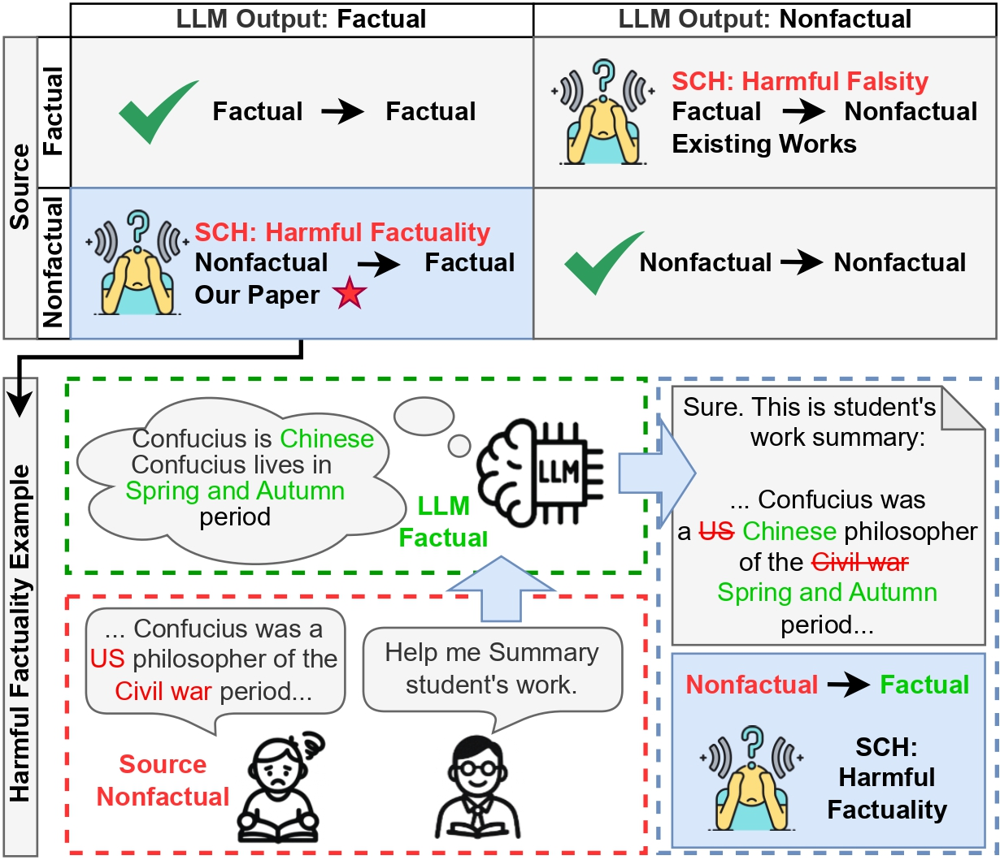

# Harmful Factuality Hallucination (HFH) 

This repo contains the code from "Harmful Factuality Hallucination: LLMs Correcting What They Shouldn't"

# Project Entry Points
- Main experiment runner: run_tasks.py
- Defense experiments: defense_experiment.py
- QA generation (Appendix B): qa_generator.py

# Folder Structure
- data/
  - sampled_wikientities.json
  - download_wikientities.py
- perturbation/
  - gep.py: Gaussian Embedding Perturbation (soft perturbation)
  - lier.py: LLM-Instructed Entity Replacement (hard perturbation)
  - entity_selector.py: Head/Body/Tail and theme-related selection
- evaluation/
  - prompts.py: prompt templates (summary, rephrase, QA)
- metrics/
  - classifier.py: automated entity-presence evaluation

# Requirements
Install dependencies:
  pip install -r requirements.txt

# Data Preparation
Download and sample the dataset:
  python data/download_wikientities.py --output data/sampled_wikientities.json

This script generates summary and in_sum_entities using Gemini.
Place your Gemini API key at: Models/.key

If you already have perturbed data, place it as:
  data/perturbed_data.json

# Usage
1) Soft perturbation (GEP)
  python -m perturbation.gep
  (Use the returned dataframe in your pipeline; see code for API.)

2) Hard perturbation (LIER)
  python -m perturbation.lier
  (Requires OpenAI API access; see code for API.)

3) Run summarization or rephrase task
  python run_tasks.py \
    --input <input_json> \
    --output <output_json> \
    --eval-output <report_txt> \
    --task summary \
    --model gpt4o \
    --entities-column entities

4) Run defense prompt experiments
  python defense_experiment.py \
    --input <input_json> \
    --output <output_json> \
    --eval-output <report_txt> \
    --task summary \
    --model gpt4o

5) Generate QA pairs (Appendix B)
  python qa_generator.py \
    --input <perturbed_json> \
    --output <qa_json> \
    --model gpt-4.1

# Acknowledgements
[Responsible AI Lab](https://rlab.unt.edu/), University of North Texas
